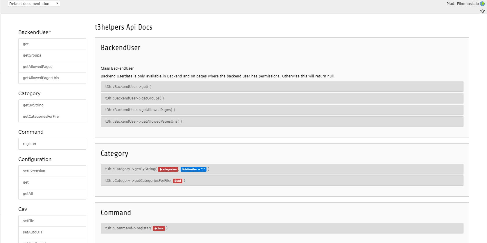

# T3Helpers - Helpers for TYPO3

Helpers for Extbase: Simple and easy functions that make your TYPO3 life with extbase and extension development a little easier. Please let me know if you have any ideas or if you find any errors, i will fix this immediately.

* **CMS**: TYPO3
* **Type**: plugin

# Information regarding TYPO3 11

I am actually working on updating all functions to TYPO3 11. Please let me know, if you find anything or if you have any enhancements. Currently, not all functions may work as usual. Most of it is still tested with TYPO3 9.

# Installation

## Composer

* https://packagist.org/packages/saschaende/t3helpers

``composer require saschaende/t3helpers``

# How to use

Type "t3h::" and get a list of all functions. For example:

```
$extension = t3h::Filesystem()->getFileExtension($_FILES['tx_semusicuserarea_musicupload']['name']['mp3'])
 ```   
 
You can find all features in:
t3helpers\Classes\Utilities

Look around in this extension, you will find many helpful tools.


